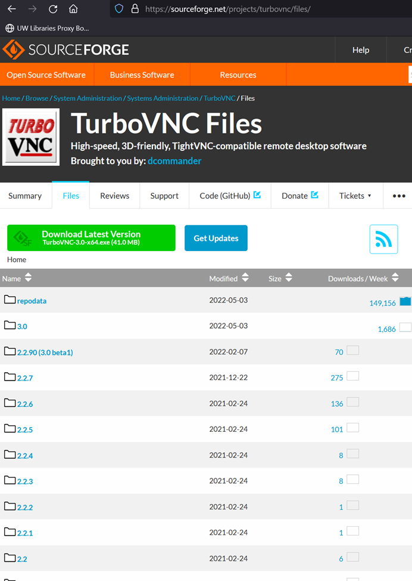
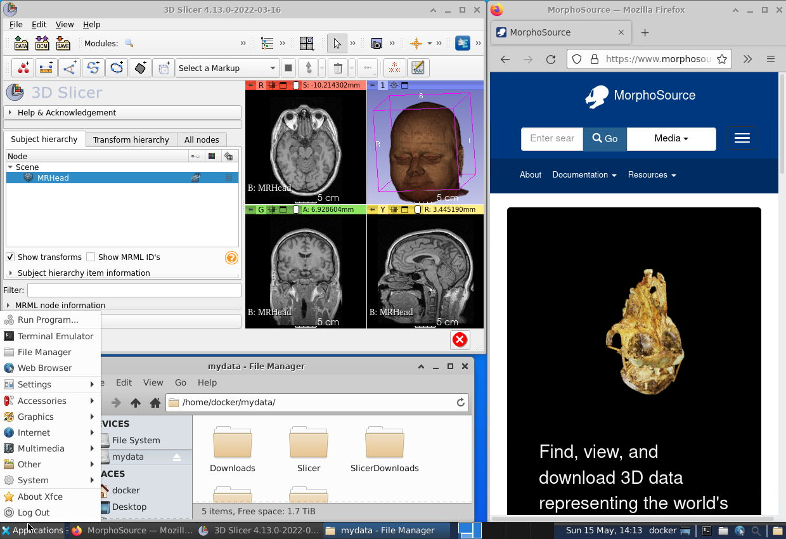
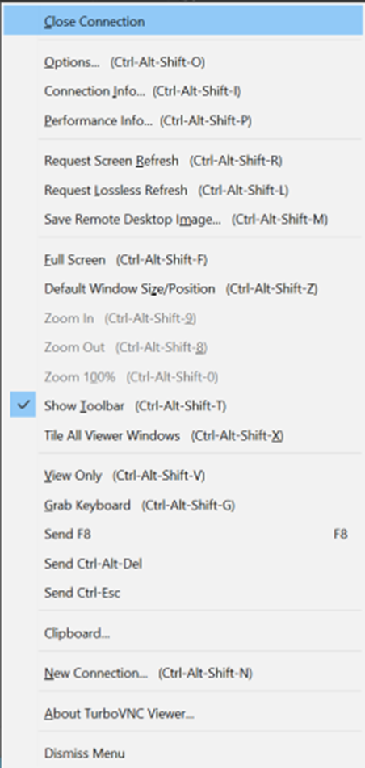

# How to access and use SlicerMorphCloud

You will need an secure shell (ssh) client on your computer and need to install TurboVNC 3.0 (available freely at https://sourceforge.net/projects/turbovnc/files/) for your operating system. 

If you do have TurboVNC previously installed on your computer, please uninstall and install the latest version (>=3.0), as previous versions do not have functionality needed for SMC access. You may also need a secure copy (scp) client to move data in and out of SMC in bulk. All operating systems provide command line versions of ssh and scp clients. 

Open TurboVNC Viewer and enter the user name and connection address provided to you in the form user@address (e.g., `mt9018@smc-1.slicermorph.org`)
When prompted, type in the SMC password provided. The initial connection may take a minute to establish. You should now see a remote desktop environment
Click **Applications->Others->Slicer** to start your 3D Slicer program. Slicer comes preinstalled with a number of extensions including SlicerMorph. Should you need any additional extensions, you can use the Extension Manager to install them.

## Keep your datasets under mydata folder
SMC is built using docker containers. Unless saved in persistent storage, all files created in a docker container are destroyed after the container stops. Thus, it is very important to keep your datasets under the folder designated as **mydata**. This is the only persistent storage on the SMC virtual environment. Data kept elsewhere will be lost after a session is restarted, and **there is no way to recover that**. 

While you are using the SMC desktop session, this persistent folder will show as **/home/docker/mydata** (notice the lack of personalized username). But on the storage volume it is mapped under your individual account (e.g., **/mydata/mt9018**). While these are the same folders, this distinction will be important if you will be using scp to transfer files (step #2 in the next section).  

## How to bring data In and Out of SMC?

You can two options to bring data in to SMC:
1. Upload your data somewhere on the cloud (e.g., Google Drive, Onedrive etc), and use the Firefox web browser (**Applications->Internet->Firefox**) in SMC desktop to download the data directly into your session. Remember to keep everything under **/home/docker/mydata** folder. This is our suggested method of moving data in and out of SMC.

2. Alternatively, you can use scp command line application to upload files directly from your personal computer to SMC. Basic syntax looks like this (on windows):

`scp C:/users/murat/Desktop/my.local.file mt9018@smc-1.slicermorph.cloud:/mydata/mt9018/SlicerScenes`

Scp will prompt you to enter your SMC password. After successfully executing the command above, my.local.file on your personal computer’s desktop will be uploaded to your SMC session under the folder **/home/docker/mydata/SlicerScenes** (in the SMC desktop session).

To move data out of SMC, you can use the same approaches above; i.e. either upload the results to cloud, or use scp. If you choose to use scp, remember to change the order of files when you are exporting data out of SMC. (e.g.,
  
`scp mt9018@smc-1.slicermorph.cloud:/mydata/mt9018/SlicerScenes/my.remote.file C:/users/murat/Desktop/`

## Optimizing SMC experience

SMC servers are located at the JetStream2 Cloud farm at Indiana University. Your internet connection speed and the network delay may impact your experience. In general, you will get the best performance, if your computer is located on a university campus network and is attached to a cabled ethernet connection, as WI-FI connections may add additional delays. 

If you are encountering consistent mouse lags, consider reducing the image quality of your VNC session. Hit `CTRL+ALT+SHIFT+O` to bring Options dialog box and choose the encoding type Tight + Medium Quality JPEG, or even low if you have a very slow connection. The medium image quality should be acceptable for most work. If you would like to capture a better rendering of the screenshot, you can hit `CTRL+ALT+SHIFT+L`, which will update the screen with a lossless image. However, if you move the mouse pointer or interact with session, the rendering will go back to medium quality (or whatever the current setting is). To save the lossless rendering directly to your computer, you can hit `CTRL+ALT+SHIFT+M`, right after you requested the lossless rendering.  

In windows/linux, if you hit `F8` (`FN+8` in Mac) in TurboVNC application, you can see all the TurboVNC menu for options and other settings  (see below). 

